# Technical Architecture Deep Dive

## Executive Summary

This document provides a comprehensive technical analysis of the ConsciousOS architecture as observed during the 100-150 day E2E simulation. It covers the complete system stack from frontend React components through to Supabase backend services.

## 1. System Architecture Overview

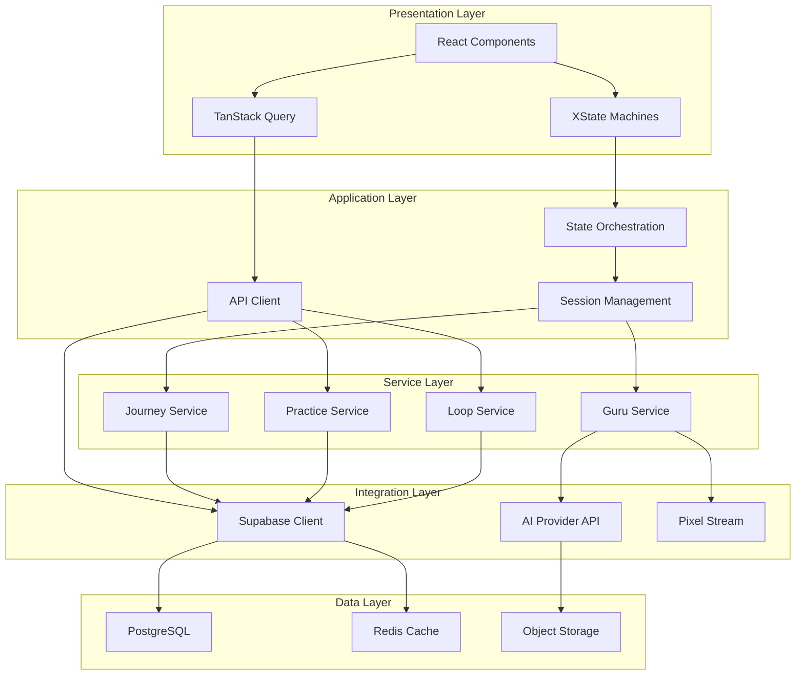
```mermaid
flowchart TB
    subgraph "Presentation Layer"
        UI1[React Components]
        UI2[XState Machines]
        UI3[TanStack Query]
    end

    subgraph "Application Layer"
        AL1[Session Management]
        AL2[State Orchestration]
        AL3[API Client]
    end

    subgraph "Service Layer"
        SL1[Guru Service]
        SL2[Journey Service]
        SL3[Practice Service]
        SL4[Loop Service]
    end

    subgraph "Integration Layer"
        IL1[Supabase Client]
        IL2[AI Provider API]
        IL3[Pixel Stream]
    end

    subgraph "Data Layer"
        DL1[PostgreSQL]
        DL2[Redis Cache]
        DL3[Object Storage]
    end

    UI1 --> UI2
    UI2 --> AL2
    UI1 --> UI3
    UI3 --> AL3
    
    AL2 --> AL1
    AL3 --> IL1
    
    AL1 --> SL1
    AL1 --> SL2
    AL3 --> SL3
    AL3 --> SL4
    
    SL1 --> IL2
    SL1 --> IL3
    SL2 --> IL1
    SL3 --> IL1
    SL4 --> IL1
    
    IL1 --> DL1
    IL1 --> DL2
    IL2 --> DL3
```

## 2. Frontend Architecture

### 2.1 Component Hierarchy

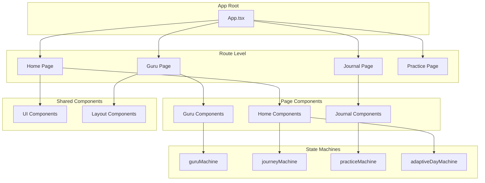
```mermaid
flowchart TB
    subgraph "App Root"
        A[App.tsx]
    end

    subgraph "Route Level"
        R1[Home Page]
        R2[Guru Page]
        R3[Journal Page]
        R4[Practice Page]
    end

    subgraph "Page Components"
        P1[Home Components]
        P2[Guru Components]
        P3[Journal Components]
    end

    subgraph "Shared Components"
        S1[UI Components]
        S2[Layout Components]
    end

    subgraph "State Machines"
        M1[guruMachine]
        M2[journeyMachine]
        M3[practiceMachine]
        M4[adaptiveDayMachine]
    end

    A --> R1
    A --> R2
    A --> R3
    A --> R4

    R1 --> P1
    R2 --> P2
    R3 --> P3

    R1 --> S1
    R2 --> S2

    P1 --> M2
    P2 --> M1
    P3 --> M3
    P1 --> M4
```

### 2.2 State Management Architecture

ConsciousOS employs a **Dual State Architecture**:

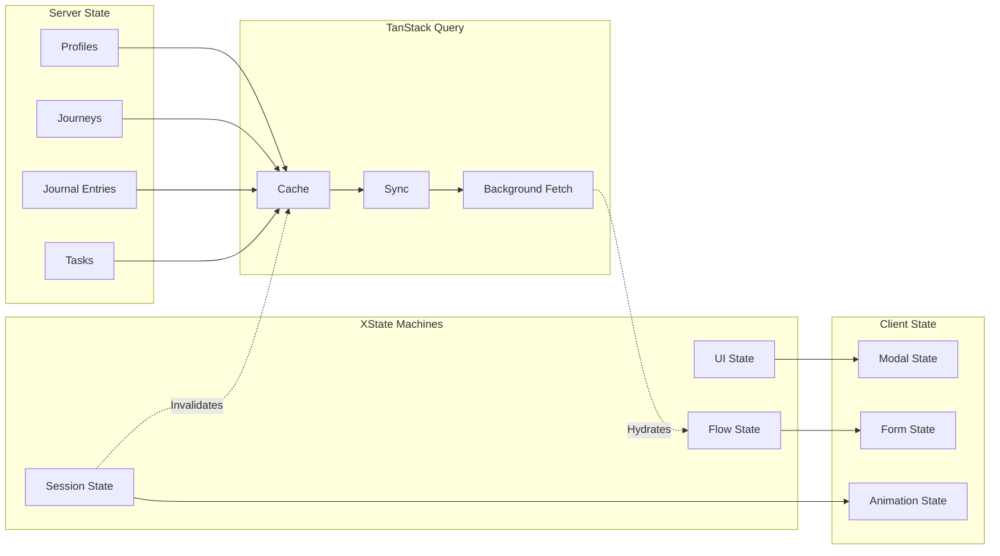
```mermaid
flowchart LR
    subgraph "Server State"
        SS1[Profiles]
        SS2[Journeys]
        SS3[Journal Entries]
        SS4[Tasks]
    end

    subgraph "TanStack Query"
        TQ1[Cache]
        TQ2[Sync]
        TQ3[Background Fetch]
    end

    subgraph "XState Machines"
        XS1[UI State]
        XS2[Flow State]
        XS3[Session State]
    end

    subgraph "Client State"
        CS1[Modal State]
        CS2[Form State]
        CS3[Animation State]
    end

    SS1 --> TQ1
    SS2 --> TQ1
    SS3 --> TQ1
    SS4 --> TQ1

    TQ1 --> TQ2
    TQ2 --> TQ3

    XS1 --> CS1
    XS2 --> CS2
    XS3 --> CS3

    TQ3 -.->|Hydrates| XS2
    XS3 -.->|Invalidates| TQ1
```

### 2.3 Key State Machines

#### guruMachine

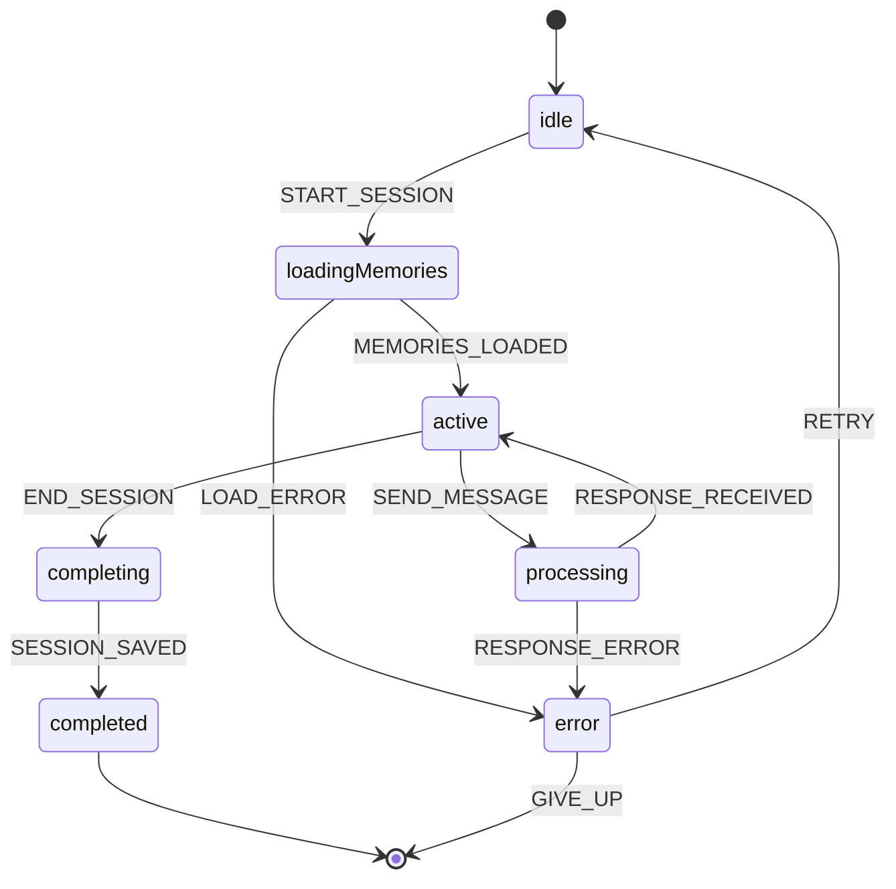
```mermaid
stateDiagram-v2
    [*] --> idle
    idle --> loadingMemories: START_SESSION
    loadingMemories --> active: MEMORIES_LOADED
    loadingMemories --> error: LOAD_ERROR
    active --> processing: SEND_MESSAGE
    processing --> active: RESPONSE_RECEIVED
    processing --> error: RESPONSE_ERROR
    active --> completing: END_SESSION
    completing --> completed: SESSION_SAVED
    completed --> [*]
    error --> idle: RETRY
    error --> [*]: GIVE_UP
```

**Context**:
```typescript
interface GuruContext {
  sessionId: string | null;
  messages: GuruMessage[];
  memories: GuruMemory[];
  status: 'idle' | 'loading' | 'active' | 'error';
  error: Error | null;
}
```

#### journeyMachine

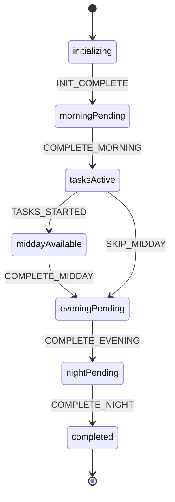
```mermaid
stateDiagram-v2
    [*] --> initializing
    initializing --> morningPending: INIT_COMPLETE
    morningPending --> tasksActive: COMPLETE_MORNING
    tasksActive --> middayAvailable: TASKS_STARTED
    middayAvailable --> eveningPending: COMPLETE_MIDDAY
    tasksActive --> eveningPending: SKIP_MIDDAY
    eveningPending --> nightPending: COMPLETE_EVENING
    nightPending --> completed: COMPLETE_NIGHT
    completed --> [*]
```

#### adaptiveDayMachine

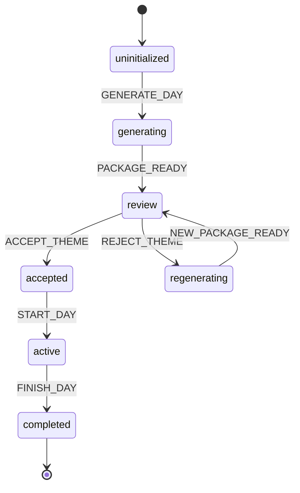
```mermaid
stateDiagram-v2
    [*] --> uninitialized
    uninitialized --> generating: GENERATE_DAY
    generating --> review: PACKAGE_READY
    review --> accepted: ACCEPT_THEME
    review --> regenerating: REJECT_THEME
    regenerating --> review: NEW_PACKAGE_READY
    accepted --> active: START_DAY
    active --> completed: FINISH_DAY
    completed --> [*]
```

## 3. Backend Architecture

### 3.1 Supabase Edge Functions

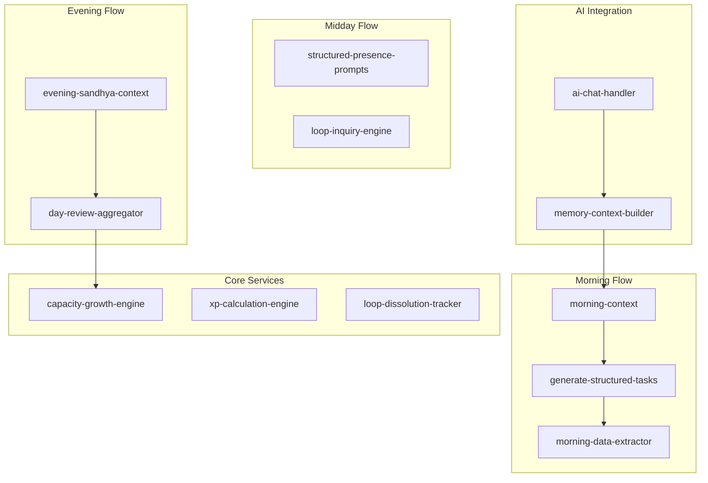
```mermaid
flowchart TB
    subgraph "Morning Flow"
        MF1[morning-context]
        MF2[generate-structured-tasks]
        MF3[morning-data-extractor]
    end

    subgraph "Midday Flow"
        MDF1[structured-presence-prompts]
        MDF2[loop-inquiry-engine]
    end

    subgraph "Evening Flow"
        EF1[evening-sandhya-context]
        EF2[day-review-aggregator]
    end

    subgraph "AI Integration"
        AIF1[ai-chat-handler]
        AIF2[memory-context-builder]
    end

    subgraph "Core Services"
        CS1[capacity-growth-engine]
        CS2[xp-calculation-engine]
        CS3[loop-dissolution-tracker]
    end

    MF1 --> MF2
    MF2 --> MF3
    
    EF1 --> EF2
    EF2 --> CS1
    
    AIF1 --> AIF2
    AIF2 --> MF1
```

### 3.2 Database Schema Relationships

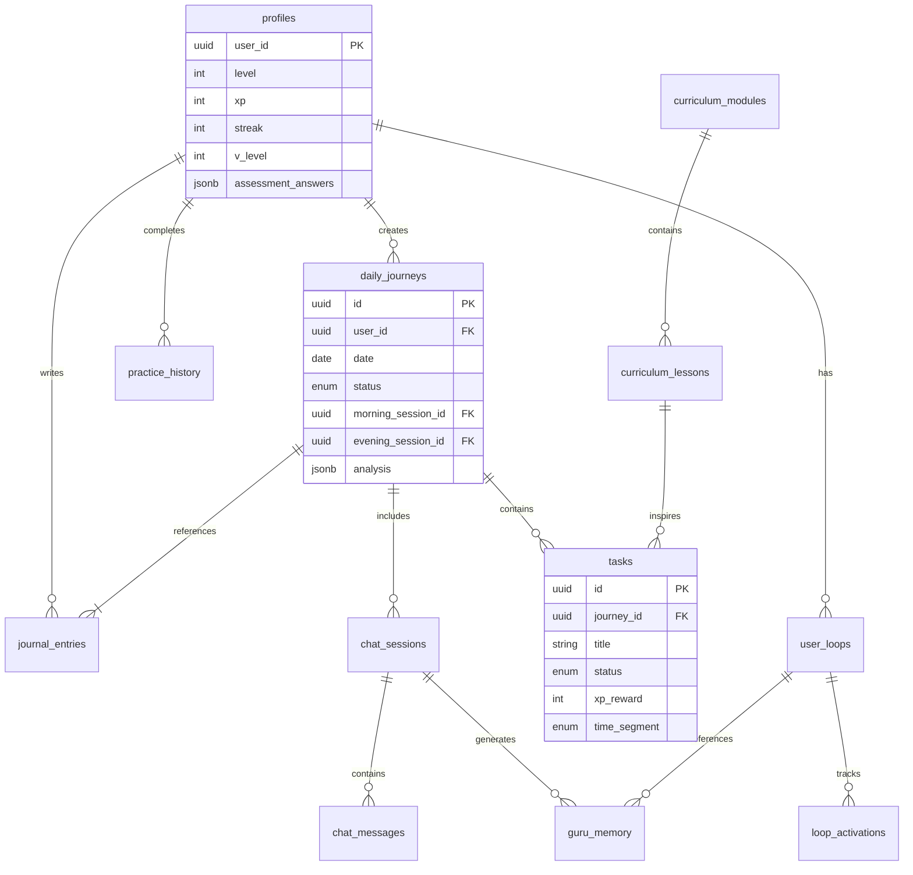
```mermaid
erDiagram
    profiles ||--o{ daily_journeys : creates
    profiles ||--o{ journal_entries : writes
    profiles ||--o{ user_loops : has
    profiles ||--o{ practice_history : completes
    
    daily_journeys ||--o{ tasks : contains
    daily_journeys ||--o{ chat_sessions : includes
    daily_journeys ||--|{ journal_entries : references
    
    chat_sessions ||--o{ chat_messages : contains
    chat_sessions ||--o{ guru_memory : generates
    
    curriculum_modules ||--o{ curriculum_lessons : contains
    curriculum_lessons ||--o{ tasks : inspires
    
    user_loops ||--o{ loop_activations : tracks
    user_loops ||--o{ guru_memory : references
    
    profiles {
        uuid user_id PK
        int level
        int xp
        int streak
        int v_level
        jsonb assessment_answers
    }
    
    daily_journeys {
        uuid id PK
        uuid user_id FK
        date date
        enum status
        uuid morning_session_id FK
        uuid evening_session_id FK
        jsonb analysis
    }
    
    tasks {
        uuid id PK
        uuid journey_id FK
        string title
        enum status
        int xp_reward
        enum time_segment
    }
```

## 4. Daily Flow Engine Architecture

### 4.1 Phase Transition Engine

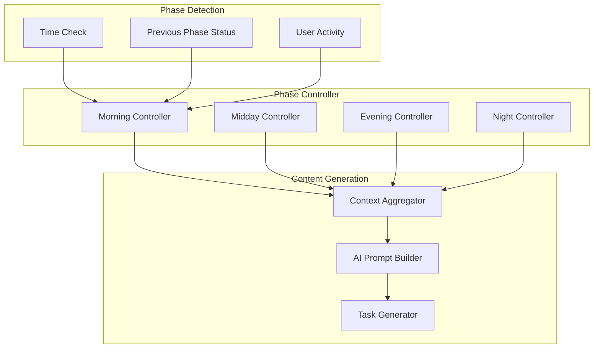
```mermaid
flowchart TB
    subgraph "Phase Detection"
        PD1[Time Check]
        PD2[Previous Phase Status]
        PD3[User Activity]
    end

    subgraph "Phase Controller"
        PC1[Morning Controller]
        PC2[Midday Controller]
        PC3[Evening Controller]
        PC4[Night Controller]
    end

    subgraph "Content Generation"
        CG1[Context Aggregator]
        CG2[AI Prompt Builder]
        CG3[Task Generator]
    end

    PD1 --> PC1
    PD2 --> PC1
    PD3 --> PC1

    PC1 --> CG1
    PC2 --> CG1
    PC3 --> CG1
    PC4 --> CG1

    CG1 --> CG2
    CG2 --> CG3
```

### 4.2 Task Generation Pipeline

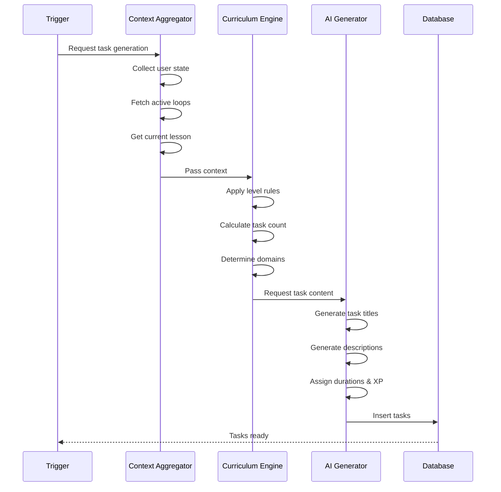
```mermaid
sequenceDiagram
    participant Trigger
    participant Context as Context Aggregator
    participant Curriculum as Curriculum Engine
    participant AI as AI Generator
    participant DB as Database

    Trigger->>Context: Request task generation
    Context->>Context: Collect user state
    Context->>Context: Fetch active loops
    Context->>Context: Get current lesson
    Context->>Curriculum: Pass context
    
    Curriculum->>Curriculum: Apply level rules
    Curriculum->>Curriculum: Calculate task count
    Curriculum->>Curriculum: Determine domains
    Curriculum->>AI: Request task content
    
    AI->>AI: Generate task titles
    AI->>AI: Generate descriptions
    AI->>AI: Assign durations & XP
    AI->>DB: Insert tasks
    
    DB-->>Trigger: Tasks ready
```

## 5. AI Integration Architecture

### 5.1 Guru AI Pipeline

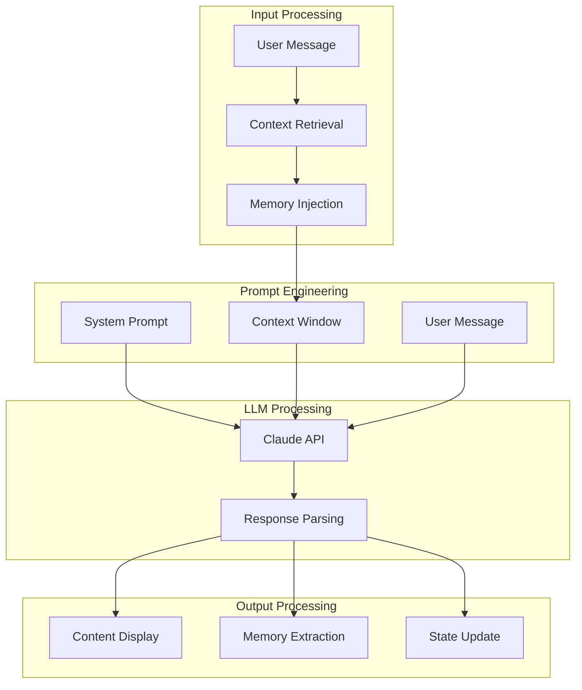
```mermaid
flowchart TB
    subgraph "Input Processing"
        IP1[User Message]
        IP2[Context Retrieval]
        IP3[Memory Injection]
    end

    subgraph "Prompt Engineering"
        PE1[System Prompt]
        PE2[Context Window]
        PE3[User Message]
    end

    subgraph "LLM Processing"
        LLM1[Claude API]
        LLM2[Response Parsing]
    end

    subgraph "Output Processing"
        OP1[Content Display]
        OP2[Memory Extraction]
        OP3[State Update]
    end

    IP1 --> IP2
    IP2 --> IP3
    IP3 --> PE2
    
    PE1 --> LLM1
    PE2 --> LLM1
    PE3 --> LLM1
    
    LLM1 --> LLM2
    LLM2 --> OP1
    LLM2 --> OP2
    LLM2 --> OP3
```

### 5.2 Context Window Management

```typescript
interface ContextWindow {
  system: string;           // Guru persona, instructions
  userProfile: string;      // Level, progress, patterns
  recentMemories: string[]; // Last 5-7 relevant memories
  conversation: Array<{
    role: 'user' | 'assistant';
    content: string;
  }>;
  currentLoop?: string;     // Active loop being worked
  sessionIntent?: string;   // User's stated intention
}
```

## 6. Memory System Architecture

### 6.1 Memory Layers

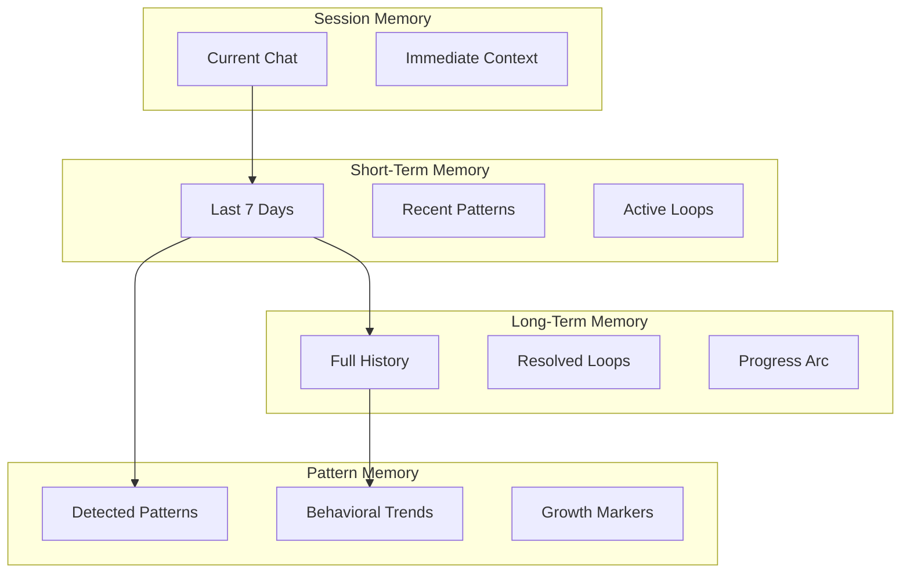
```mermaid
flowchart TB
    subgraph "Session Memory"
        SM1[Current Chat]
        SM2[Immediate Context]
    end

    subgraph "Short-Term Memory"
        STM1[Last 7 Days]
        STM2[Recent Patterns]
        STM3[Active Loops]
    end

    subgraph "Long-Term Memory"
        LTM1[Full History]
        LTM2[Resolved Loops]
        LTM3[Progress Arc]
    end

    subgraph "Pattern Memory"
        PM1[Detected Patterns]
        PM2[Behavioral Trends]
        PM3[Growth Markers]
    end

    SM1 --> STM1
    STM1 --> LTM1
    STM1 --> PM1
    LTM1 --> PM2
```

### 6.2 Memory Retrieval Flow

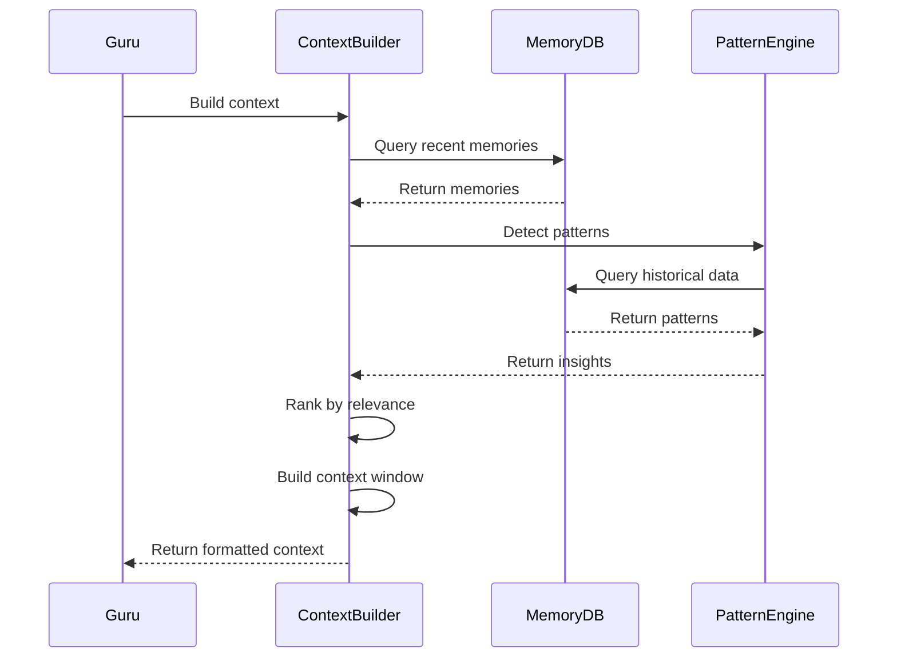
```mermaid
sequenceDiagram
    participant Guru
    participant ContextBuilder
    participant MemoryDB
    participant PatternEngine

    Guru->>ContextBuilder: Build context
    ContextBuilder->>MemoryDB: Query recent memories
    MemoryDB-->>ContextBuilder: Return memories
    
    ContextBuilder->>PatternEngine: Detect patterns
    PatternEngine->>MemoryDB: Query historical data
    MemoryDB-->>PatternEngine: Return patterns
    PatternEngine-->>ContextBuilder: Return insights
    
    ContextBuilder->>ContextBuilder: Rank by relevance
    ContextBuilder->>ContextBuilder: Build context window
    ContextBuilder-->>Guru: Return formatted context
```

## 7. Real-Time Architecture

### 7.1 Supabase Realtime Integration

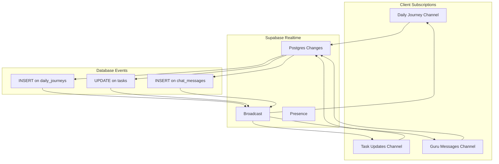
```mermaid
flowchart TB
    subgraph "Client Subscriptions"
        CS1[Daily Journey Channel]
        CS2[Task Updates Channel]
        CS3[Guru Messages Channel]
    end

    subgraph "Supabase Realtime"
        RT1[Postgres Changes]
        RT2[Broadcast]
        RT3[Presence]
    end

    subgraph "Database Events"
        DBE1[INSERT on daily_journeys]
        DBE2[UPDATE on tasks]
        DBE3[INSERT on chat_messages]
    end

    CS1 --> RT1
    CS2 --> RT1
    CS3 --> RT1

    RT1 --> DBE1
    RT1 --> DBE2
    RT1 --> DBE3

    DBE1 --> RT2
    DBE2 --> RT2
    DBE3 --> RT2

    RT2 --> CS1
    RT2 --> CS2
    RT2 --> CS3
```

### 7.2 Event Flow Example

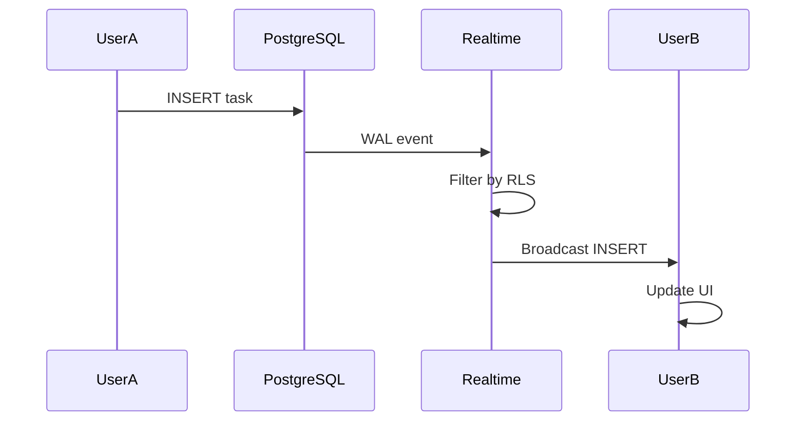
```mermaid
sequenceDiagram
    participant UserA
    participant DB as PostgreSQL
    participant RT as Realtime
    participant UserB

    UserA->>DB: INSERT task
    DB->>RT: WAL event
    RT->>RT: Filter by RLS
    RT->>UserB: Broadcast INSERT
    UserB->>UserB: Update UI
```

## 8. Security Architecture

### 8.1 Row Level Security (RLS)

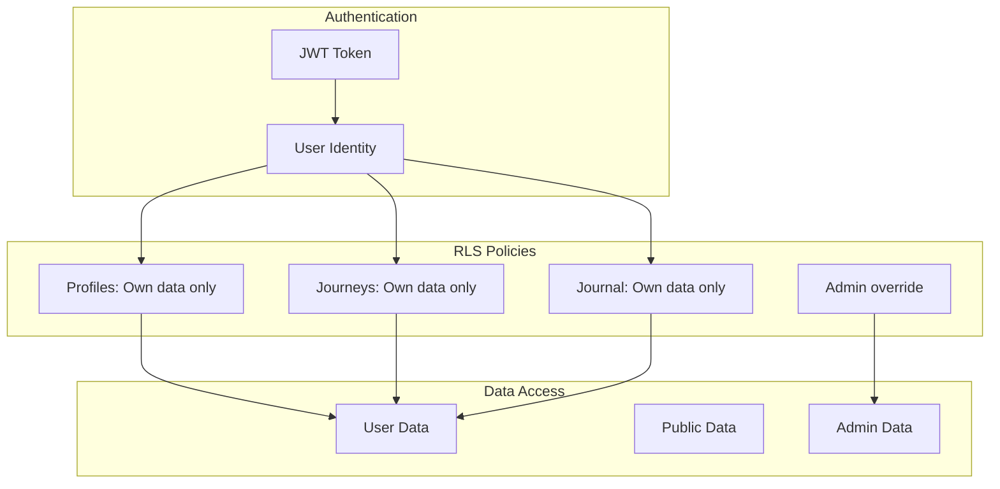
```mermaid
flowchart TB
    subgraph "Authentication"
        A1[JWT Token]
        A2[User Identity]
    end

    subgraph "RLS Policies"
        RLS1[Profiles: Own data only]
        RLS2[Journeys: Own data only]
        RLS3[Journal: Own data only]
        RLS4[Admin override]
    end

    subgraph "Data Access"
        DA1[User Data]
        DA2[Public Data]
        DA3[Admin Data]
    end

    A1 --> A2
    A2 --> RLS1
    A2 --> RLS2
    A2 --> RLS3

    RLS1 --> DA1
    RLS2 --> DA1
    RLS3 --> DA1
    RLS4 --> DA3
```

### 8.2 Policy Examples

```sql
-- Users can only view own profile
CREATE POLICY "Users can view own profile"
  ON profiles FOR SELECT
  USING (auth.uid() = user_id);

-- Users can only update own profile
CREATE POLICY "Users can update own profile"
  ON profiles FOR UPDATE
  USING (auth.uid() = user_id);

-- Service role can manage engine logs
CREATE POLICY "Service role manages engine logs"
  ON engine_logs FOR ALL
  USING (auth.jwt()->>'role' = 'service_role');
```

## 9. Performance Architecture

### 9.1 Caching Strategy

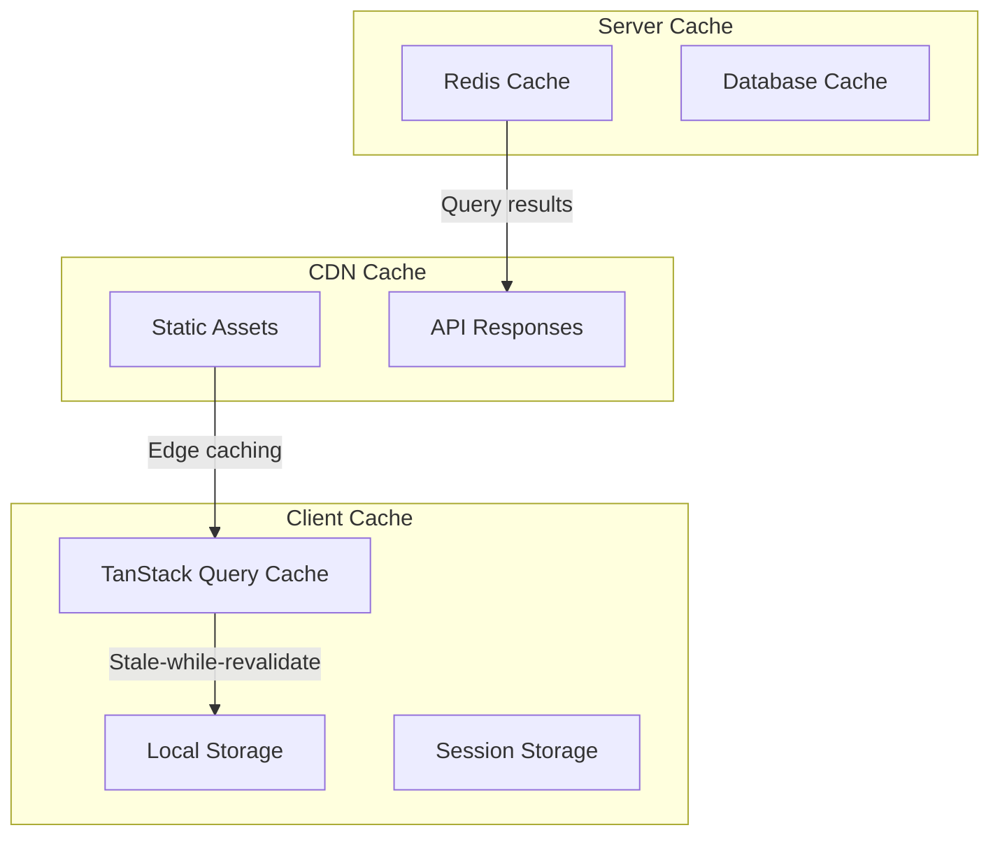
```mermaid
flowchart TB
    subgraph "Client Cache"
        CC1[TanStack Query Cache]
        CC2[Local Storage]
        CC3[Session Storage]
    end

    subgraph "CDN Cache"
        CDN1[Static Assets]
        CDN2[API Responses]
    end

    subgraph "Server Cache"
        SC1[Redis Cache]
        SC2[Database Cache]
    end

    CC1 -->|Stale-while-revalidate| CC2
    CDN1 -->|Edge caching| CC1
    SC1 -->|Query results| CDN2
```

### 9.2 Optimization Patterns

| Layer | Strategy | Implementation |
|-------|----------|----------------|
| Client | Code splitting | Vite dynamic imports |
| Client | Lazy loading | React.lazy + Suspense |
| API | Request batching | TanStack Query batching |
| API | Debouncing | 300ms on search inputs |
| Database | Indexing | Multi-column indexes |
| Database | Query optimization | EXPLAIN ANALYZE |

## 10. Testing Architecture Integration

### 10.1 E2E Test Architecture

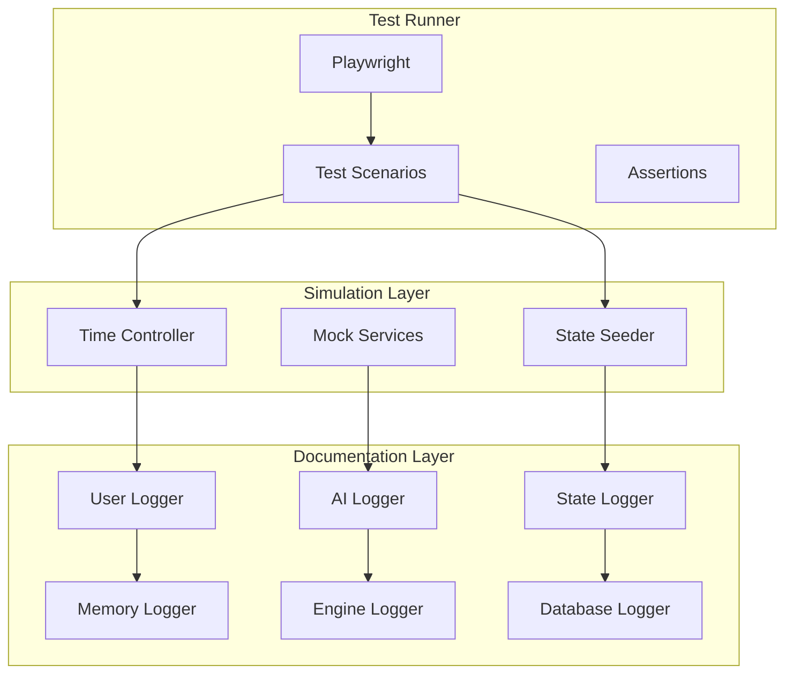
```mermaid
flowchart TB
    subgraph "Test Runner"
        TR1[Playwright]
        TR2[Test Scenarios]
        TR3[Assertions]
    end

    subgraph "Simulation Layer"
        SL1[Time Controller]
        SL2[State Seeder]
        SL3[Mock Services]
    end

    subgraph "Documentation Layer"
        DL1[User Logger]
        DL2[AI Logger]
        DL3[State Logger]
        DL4[Memory Logger]
        DL5[Engine Logger]
        DL6[Database Logger]
    end

    TR1 --> TR2
    TR2 --> SL1
    TR2 --> SL2
    
    SL1 --> DL1
    SL2 --> DL3
    SL3 --> DL2
    
    DL1 --> DL4
    DL2 --> DL5
    DL3 --> DL6
```

### 10.2 Test Flow Integration

The E2E framework integrates with the existing architecture through:

1. **Time Control**: Overrides browser Date to simulate time passage
2. **State Seeding**: Pre-populates database with fixture data
3. **API Mocking**: Intercepts and logs Supabase calls
4. **State Inspection**: Accesses XState machines via window.__XSTATE__
5. **Memory Tracking**: Monitors localStorage and IndexedDB
